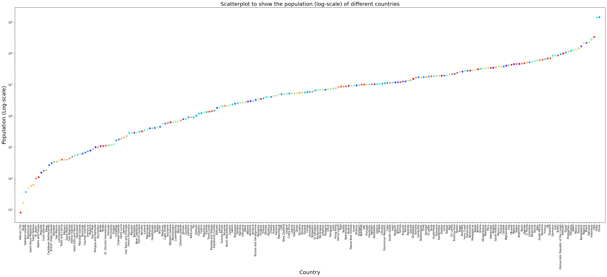
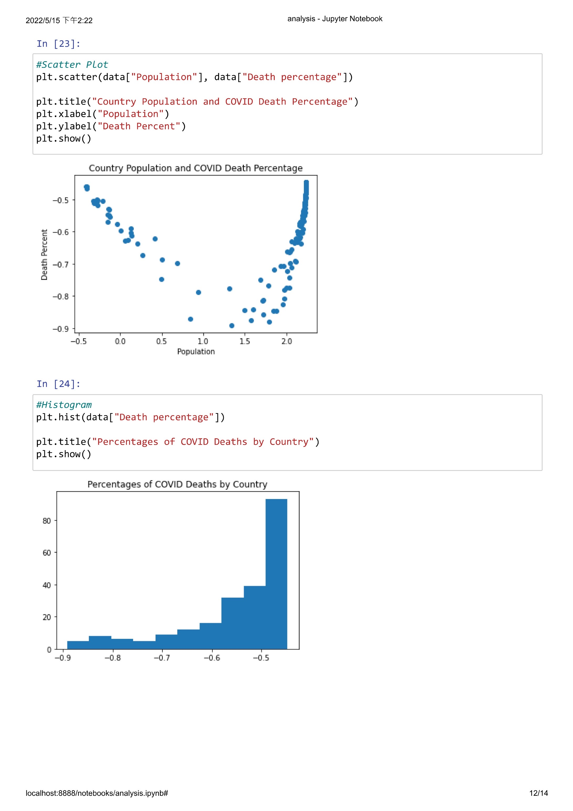

# Covid-19-Coronavirus-Pandemic-Analyzation

## Background  
Coronavirus disease 2019 (COVID-19(, also known as severe special infectious pneumonia, is an infectious disease caused by SARS-CoV-2. Since it was first diagnosed in Wuhan, Hubei Province, China in late 2019, it has spread rapidly and the epidemic has spread to countries around the world. The number of infections and deaths is high, and it is still spreading, and it is not known when it will stop. It is arguably the most serious challenge facing humanity since the Second World War.  

1. Data Scource  
Kaggle: [COVID-19. Exploratory Data Analysis](https://www.kaggle.com/code/georgyzubkov/covid-19-exploratory-data-analysis/data)  
2. Objective  
COVID-19 is already a global disease that cannot be separated from its effects on human societies everywhere in the world. This resource set contains information on countries, regions, and the impact of the coronavirus. By analyzing the correlation of this information, we hope to understand the spread and role of the epidemic in different parts of the world, and discuss the possible causes accordingly.  

## Data Analysis
1. **Data Preperation**  
    - Missing Values Processing
    - Data Scaling
2. **Summary of the Data**
    - DataFrame Information
    - DataFrame Statistical Information
  
  
## Data Visualization
1. Use the **scatter plot** to plot the population of different countries for the Country and Population:  
    As can be seen from the data, the number of countries is huge, so the population of each country is plotted one by one in the form of a scatter chart.  
      
    $\implies$ It can be found that the population of each country in this data is different, and the difference between the most populous and least populous countries is even $10^3$ times.
2. Plot the data value size of different continents and regions for different continents and each field with **bar chart**:  
    - Population v.s. Continent
      
      
    - Total Cases v.s. Continent
      
      
    - Total Deaths v.s. Continent
      
      
    $\implies$ The chart of total cases and total deaths is similar in shape, indicating that the fatality rate of the virus does not vary by region. South America, on the other hand, has a much higher number of deaths than the number of infections, which may indicate that the number of infections recorded is not close to the facts.  
    $\implies$ The "Total Cases v.s. Continent" chart shows that among all the cases in the continent, Europe has the largest number of cases, which even surpasses Asia, the birthplace of Covid-19. It may be due to the degree of internationalization in Europe, and as the birthplace, Asia's epidemic prevention measures are more timely, which also leads to the largest number of cases in Europe in the figure above.  
    $\implies$ Africa has the second largest population, but the number of infections and deaths is the bottom. The possible reasons are as follows:
    > The government has put less effort into keeping track of the coronavirus figures.
    > The economic model is different from other continents. There is less interaction between traffic and interaction, and the virus is more difficult to spread.

     - Tot Cases//1M pop v.s. Continent  
       
       
      - Tot Deaths//1M pop v.s. Continent
       
       
     - Death percentage v.s. Continent  
       
       
    $\implies$ From the above figures, it can be seen that among the top 5 data, different continents have different fields of different fields. Among Total Deaths, North America is the most serious case. Referring to the previous 6 continents per population (as shown in the figure below), it can be seen from the population of each state in this case that Asia has the largest population. Its total deaths are not the largest, but the highest death percentage.  
      
      
    $\implies$ Although Asia is large in terms of numbers, the infection and death rate in Asia is lower than most continents when measured proportionally due to the large number of Asian people.  
      
    $\implies$ Although Africa has a lower number of infections than other continents, it has the highest mortality rate, which may reflect the relative scarcity of medical resources in Africa compared to other continents. It is more difficult to cope with post-epidemic dangerous situations.  
  

3. Analyze the relationship between Continent and Total Cases with **bar chart**:  
  
It can be seen from the figure that among the cases in all continents, Europe has the largest number of cases, even surpassing Asia, the birthplace of Covid-19. This situation is because the degree of internationalization is more developed in Europe, and as the birthplace, Asia's epidemic prevention measures are more timely, which also leads to the largest number of cases in Europe in the figure above.  
  
  
4. Analyze the relationship between Population and Death percentage with **scatter plots**:  
  
As shown in the figure, the cases with the highest death rate are mostly located in the areas with the largest and least populous populations, which is likely to be related to the degree of internationalization and the advanced level of medical equipment: countries with small populations have less developed science and technology, and medical equipment is not very advanced, resulting in extremely high mortality rates; Countries with larger populations have more developed science and technology and a higher degree of internationalization, so the frequency of population movement is higher. The more people they are exposed to, the higher the chance of infection, and the higher the mortality rate.  
  
5. Analyze death rates with **box plots**:  
  
In the dataset, the death rate of COVID-19 is mostly concentrated within 0.1% ~ 2.5%, and only a few data exceed 5%.  
  
## Discussion and Conclusion  
1. Discussion  
    - Population size is related to deaths.
    - Among continents, North America has the highest number of deaths, but the highest proportion of deaths is in Asia.
    - The mortality rate of COVID-19 is currently between 0.1% ~ 2.5% and is still a dangerous infectious disease.  
  
2. Conclusion  
     - Among the continents, although Asia has the largest population, Europe has the highest number of deaths, followed by South America.
     - In the comparison of continents, Africa has the second largest population, but the number of infected people ranks behind; Europe has a smaller population, but the number of infections is at the top. There are certain differences in the economic development and operation of the two continents.
